# Application Architecture Flow Diagrams

This document illustrates both traditional and AI-powered application architectures with proper separation of concerns and data flow.

## Traditional Three-Tier Architecture

```mermaid
flowchart TD
    %% Client Tier
    subgraph "Client Tier"
        A[👤 Web Browser]
        B[📱 Mobile App]
        C[🖥️ Desktop App]
    end
    
    %% Web Server Tier
    subgraph "Web Server Tier"
        D[🌐 Load Balancer<br/>nginx/HAProxy]
        E[🖥️ Web Server 1<br/>nginx/Apache]
        F[🖥️ Web Server 2<br/>nginx/Apache]
        G[🖥️ Web Server N<br/>nginx/Apache]
    end
    
    %% Application Server Tier
    subgraph "Application Server Tier"
        H[⚙️ App Server 1<br/>Node.js/Java/.NET]
        I[⚙️ App Server 2<br/>Node.js/Java/.NET]
        J[⚙️ App Server N<br/>Node.js/Java/.NET]
    end
    
    %% Data Tier
    subgraph "Data Tier"
        K[(🗄️ Primary Database<br/>PostgreSQL/MySQL)]
        L[(📚 Read Replica<br/>Database)]
        M[🗂️ Cache Layer<br/>Redis/Memcached]
        N[📁 File Storage<br/>AWS S3/Azure Blob]
    end
    
    %% External Services
    subgraph "External Services"
        O[🔐 Authentication<br/>Auth0/OAuth]
        P[📧 Email Service<br/>SendGrid/SES]
        Q[💳 Payment Gateway<br/>Stripe/PayPal]
        R[📊 Analytics<br/>Google Analytics]
    end
    
    %% Client to Web Server connections
    A ---|HTTPS/443| D
    B ---|HTTPS/443| D
    C ---|HTTPS/443| D
    
    %% Load balancer to web servers
    D ---|Round Robin| E
    D ---|Round Robin| F
    D ---|Round Robin| G
    
    %% Web servers to app servers
    E ---|HTTP/8080| H
    E ---|HTTP/8080| I
    F ---|HTTP/8080| I
    F ---|HTTP/8080| J
    G ---|HTTP/8080| H
    G ---|HTTP/8080| J
    
    %% App servers to data tier
    H ---|SQL/5432| K
    H ---|Redis/6379| M
    H ---|HTTP/443| N
    
    I ---|SQL/5432| K
    I ---|SQL/5432| L
    I ---|Redis/6379| M
    I ---|HTTP/443| N
    
    J ---|SQL/5432| L
    J ---|Redis/6379| M
    J ---|HTTP/443| N
    
    %% Database replication
    K -.->|Replication| L
    
    %% External service connections
    H ---|OAuth 2.0| O
    I ---|SMTP/587| P
    J ---|HTTPS/443| Q
    H ---|HTTPS/443| R
    
    %% Dynatrace Branding Colors
    classDef clientStyle fill:#f5f7ff,stroke:#6f2da8,stroke-width:3px,color:#1a1a1a,stroke-dasharray: 0
    classDef webStyle fill:#eef5ff,stroke:#1496ff,stroke-width:3px,color:#1a1a1a,stroke-dasharray: 0
    classDef appStyle fill:#f0fdf4,stroke:#00a86b,stroke-width:3px,color:#1a1a1a,stroke-dasharray: 0
    classDef dataStyle fill:#fff7ed,stroke:#fd8c00,stroke-width:3px,color:#1a1a1a,stroke-dasharray: 0
    classDef externalStyle fill:#fef2f2,stroke:#dc2626,stroke-width:3px,color:#1a1a1a,stroke-dasharray: 0
    
    class A,B,C clientStyle
    class D,E,F,G webStyle
    class H,I,J appStyle
    class K,L,M,N dataStyle
    class O,P,Q,R externalStyle
```

### Architecture Components

#### 🎯 Client Tier

- **Web Browser**: Users access the application through modern web browsers
- **Mobile App**: Native or hybrid mobile applications for iOS/Android
- **Desktop App**: Desktop applications for Windows/macOS/Linux

#### 🌐 Web Server Tier

- **Load Balancer**: Distributes incoming requests across multiple web servers
- **Web Servers**: Handle static content, SSL termination, and reverse proxy to app servers
- **Benefits**: High availability, scalability, and performance optimization

#### ⚙️ Application Server Tier

- **App Servers**: Execute business logic, process requests, and manage sessions
- **Technologies**: Node.js, Java (Spring), .NET, Python (Django/Flask), etc.
- **Features**: Auto-scaling, stateless design, microservices architecture

#### 🗄️ Data Tier

- **Primary Database**: Main transactional database for CRUD operations
- **Read Replica**: Read-only database copies to distribute read load
- **Cache Layer**: In-memory caching for frequently accessed data
- **File Storage**: Object storage for files, images, and documents

#### 🔗 External Services

- **Authentication**: Third-party identity providers for secure login
- **Email Service**: Transactional and marketing email delivery
- **Payment Gateway**: Secure payment processing and transactions
- **Analytics**: User behavior tracking and business intelligence

### 📊 Data Flow

1. **Request Flow**: Client → Load Balancer → Web Server → App Server
2. **Data Access**: App Server → Cache/Database → Response back through chain
3. **External Integration**: App Server ↔ External Services (async when possible)
4. **Monitoring**: All tiers log to centralized logging and monitoring systems

### 🏗️ Architecture Benefits

- **Scalability**: Each tier can scale independently based on demand
- **Reliability**: Redundancy at each level ensures high availability
- **Security**: Multiple layers of security controls and isolation
- **Maintainability**: Clear separation of concerns makes updates easier
- **Performance**: Caching and load distribution optimize response times

---

## AI Application Architecture

This diagram illustrates the specialized architecture for AI-powered applications, including guardrails and hallucination prevention mechanisms.

```mermaid
flowchart TD
    %% Client Tier
    subgraph "Presentation Layer (The Senses 👀)"
        A[🌐 React/Vue Frontend]
        B[📱 Mobile App<br/>React Native/Flutter]
        C[🖥️ Desktop App<br/>Electron/Native]
    end
    
    %% Application Layer
    subgraph "Application Layer (The Conscious Brain 🧠)"
        D[🔄 Load Balancer<br/>nginx/HAProxy]
        E[🚀 API Server<br/>FastAPI/Node.js]
        F[📋 Task Queue<br/>Redis/RabbitMQ]
        G[⚙️ Worker Process 1<br/>Celery/Background Jobs]
        H[⚙️ Worker Process 2<br/>Celery/Background Jobs]
        I[⚙️ Worker Process N<br/>Celery/Background Jobs]
    end
    
    %% AI/ML Service Layer
    subgraph "AI/ML Service Layer (The Subconscious ⚡)"
        J[🛡️ Pre-Processing<br/>Prompt Engineering]
        K[🤖 AI Model Server<br/>TensorFlow Serving/TorchServe]
        L[🔍 Post-Processing<br/>Validation & Filtering]
        M[⚖️ Judge Model<br/>Safety Classifier]
    end
    
    %% Guardrails System
    subgraph "Guardrails & Safety 🛡️"
        N[🚨 Input Validation<br/>Malicious Content Filter]
        O[📊 Confidence Scoring<br/>Threshold Checking]
        P[✅ Fact Checker<br/>RAG Verification]
        Q[🔒 Output Sanitizer<br/>Content Filtering]
    end
    
    %% Data & Persistence Layer
    subgraph "Data & Persistence Layer (The Memory 💾)"
        R[(🗃️ Application DB<br/>PostgreSQL/MongoDB)]
        S[(🧠 Vector Database<br/>Pinecone/Chroma)]
        T[☁️ Object Storage<br/>S3/Azure Blob]
        U[📦 Model Registry<br/>MLflow/WandB]
        V[📚 Knowledge Base<br/>Trusted Sources]
    end
    
    %% External AI Services
    subgraph "External AI Services 🌐"
        W[🔮 LLM APIs<br/>OpenAI/Anthropic]
        X[👁️ Vision APIs<br/>Google Vision/AWS Rekognition]
        Y[🗣️ Speech APIs<br/>Azure Speech/AWS Transcribe]
        Z[🔍 Search APIs<br/>Elasticsearch/Algolia]
    end
    
    %% User interactions
    A ---|HTTPS Request| D
    B ---|HTTPS Request| D
    C ---|HTTPS Request| D
    
    %% Load balancing
    D ---|Route Request| E
    
    %% API to Task Queue
    E ---|Async Job| F
    E ---|Status Check| R
    
    %% Task Queue to Workers
    F ---|Pick Job| G
    F ---|Pick Job| H
    F ---|Pick Job| I
    
    %% Workers to Guardrails
    G ---|Input Check| N
    H ---|Input Check| N
    I ---|Input Check| N
    
    %% Pre-processing Flow
    N ---|Validated Input| J
    J ---|Engineered Prompt| K
    
    %% AI Model Processing
    K ---|Raw Output| L
    K ---|Backup Call| W
    
    %% Post-processing & Validation
    L ---|Check Output| M
    L ---|Validate Facts| P
    L ---|Score Confidence| O
    M ---|Safety Check| Q
    
    %% RAG Flow for Fact Checking
    P ---|Query| S
    P ---|Search| V
    S ---|Embeddings| P
    V ---|Facts| P
    
    %% Final Output
    Q ---|Safe Output| G
    Q ---|Safe Output| H
    Q ---|Safe Output| I
    
    %% Data Storage
    G ---|Store Result| R
    G ---|Log Interaction| R
    H ---|Store Files| T
    I ---|Update Embeddings| S
    
    %% Model Management
    K ---|Load Model| U
    U ---|Model Versions| K
    
    %% External Service Integration
    K ---|API Calls| W
    K ---|Vision Tasks| X
    K ---|Speech Tasks| Y
    P ---|Search Query| Z
    
    %% Feedback Loop
    A -.->|User Feedback| E
    B -.->|Thumbs Up/Down| E
    C -.->|Report Issues| E
    
    %% Monitoring & Logging
    E -.->|Metrics| R
    G -.->|Performance Logs| R
    K -.->|Model Metrics| U
    
    %% Dynatrace AI Architecture Styling
    classDef presentationStyle fill:#f5f7ff,stroke:#6f2da8,stroke-width:3px,color:#1a1a1a,stroke-dasharray: 0
    classDef applicationStyle fill:#eef5ff,stroke:#1496ff,stroke-width:3px,color:#1a1a1a,stroke-dasharray: 0
    classDef aiStyle fill:#fff7ed,stroke:#fd8c00,stroke-width:3px,color:#1a1a1a,stroke-dasharray: 0
    classDef guardrailStyle fill:#fef2f2,stroke:#dc2626,stroke-width:3px,color:#1a1a1a,stroke-dasharray: 0
    classDef dataStyle fill:#f0fdf4,stroke:#00a86b,stroke-width:3px,color:#1a1a1a,stroke-dasharray: 0
    classDef externalStyle fill:#f8fafc,stroke:#64748b,stroke-width:3px,color:#1a1a1a,stroke-dasharray: 0
    
    class A,B,C presentationStyle
    class D,E,F,G,H,I applicationStyle
    class J,K,L,M aiStyle
    class N,O,P,Q guardrailStyle
    class R,S,T,U,V dataStyle
    class W,X,Y,Z externalStyle
```

### AI Architecture Components Explained

#### 🎯 Presentation Layer (The Senses 👀)

The user interface that collects input and displays AI-generated results with proper disclaimers and source citations.

**Key Features:**

- **Source Attribution**: Shows where AI got its information from
- **Confidence Indicators**: Visual cues about answer reliability  
- **Feedback Mechanisms**: Thumbs up/down for continuous improvement
- **Real-time Status**: Shows processing state ("thinking", "complete")

#### 🧠 Application Layer (The Conscious Brain)

The orchestration layer that manages the complex workflow of AI processing with asynchronous task handling.

**Critical Components:**

- **API Server**: Immediately responds with job status, doesn't wait for AI processing
- **Task Queue**: Handles long-running AI operations without blocking users
- **Worker Processes**: Execute the heavy lifting of AI model communication
- **Async Processing**: Essential for AI apps due to model inference latency

#### ⚡ AI/ML Service Layer (The Subconscious)

The specialized inference engine optimized for fast, reliable AI predictions.

**Processing Pipeline:**

1. **Pre-Processing**: Prompt engineering and input formatting
2. **Model Inference**: Actual AI prediction (the "thinking" step)
3. **Post-Processing**: Output validation and formatting
4. **Safety Checks**: Judge model validates output safety

#### 🛡️ Guardrails & Safety System

Multi-layered defense against AI hallucination and harmful outputs.

**Defense Layers:**

- **Input Validation**: Blocks malicious prompts and jailbreak attempts
- **Confidence Scoring**: Rejects low-confidence predictions
- **Fact Checking (RAG)**: Grounds responses in verified knowledge
- **Output Sanitization**: Final filter before user sees results

#### 💾 Data & Persistence Layer (The Memory)

Specialized storage systems for AI application needs.

**Storage Types:**

- **Application DB**: Standard user data and application state
- **Vector Database**: Embeddings for semantic search and RAG
- **Object Storage**: Large files (images, audio, model weights)
- **Model Registry**: Version control for AI models and performance tracking
- **Knowledge Base**: Curated, trusted information sources

### 🔄 Example: AI Image Description Workflow

Let's trace how an image description request flows through this architecture:

1. **User Upload**: User uploads cat photo via React frontend
2. **API Response**: FastAPI immediately returns `{"status": "processing", "job_id": "123"}`
3. **Task Queuing**: Job placed in Redis queue with image S3 location
4. **Worker Processing**:
   - Celery worker picks up job
   - **Input Validation**: Checks image isn't malicious
   - **Pre-processing**: Resizes to 224x224, normalizes pixels
5. **AI Inference**: TensorFlow Serving processes image → `['cat', 'sitting', 'sofa']`
6. **Post-processing**:
   - **Confidence Check**: Ensures model confidence > 0.8
   - **Output Formatting**: Converts to "A cat sitting on a sofa"
   - **Safety Validation**: Judge model confirms output is appropriate
7. **Storage**: Result saved to PostgreSQL with user link
8. **Frontend Update**: React polls and displays final description with confidence indicator

### 🚨 Hallucination Prevention Strategy

#### Where Hallucination Comes From

- **Statistical Prediction**: LLMs predict next words, don't "know" facts
- **Training Gaps**: Missing or biased training data leads to invented facts
- **Lost Context**: Complex reasoning can drift from initial constraints

#### Where We Build Guardrails

**🔹 Pre-Processing (Application Layer):**

- Prompt engineering with factual constraints
- Input sanitization and validation
- Context injection from knowledge bases

**🔹 Model Configuration (AI Layer):**

- Low temperature (0.1-0.3) for factual tasks
- Specialized fact-checking models
- Parameter tuning for reliability over creativity

**🔹 Post-Processing (Guardrails Layer):**

- **RAG Fact-Checking**: Compare output against vector database
- **Judge Model Validation**: Second AI model rates first model's safety
- **Confidence Thresholding**: Reject uncertain responses
- **Pattern Matching**: Flag suspicious URLs, citations, or claims

**🔹 User Interface (Presentation Layer):**

- Source citations and confidence scores
- Clear AI disclaimers
- Easy feedback mechanisms for continuous improvement

### 🎯 Key AI Architecture Benefits

- **Reliability**: Multi-layer validation prevents hallucinated responses
- **Performance**: Asynchronous processing handles AI latency gracefully  
- **Scalability**: Workers can scale based on AI processing demand
- **Safety**: Comprehensive guardrails at every layer
- **Traceability**: Full logging of AI decisions and user interactions
- **Flexibility**: Can integrate multiple AI models and external services